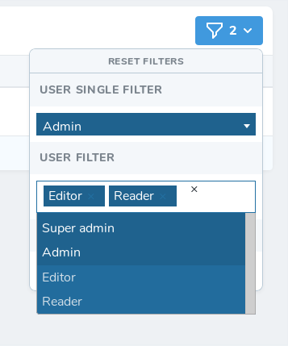

# nova-select2-filter
Works with both solo and multi select

## Instalation

`composer require angauber/nova-select2-filter`

## Usage
Create a new filter with 

`php artisan nova:filter MyNewFilter`

Then replace it's content like so

    

    <?php
        
        namespace App\Nova\Filters;
        
        use Illuminate\Database\Eloquent\Builder;
        use Illuminate\Http\Request;
        use Angauber\NovaSelect2Filter\NovaSelect2Filter;
        
        class ContactType extends NovaSelect2Filter
        {
        	public $component = 'nova-select2-filter';
        
        	public function apply(Request $request, $query, $value) {
        		return $query;
        	}
        
        	public function options(Request $request) {
        		return [];
        	}
        
        	public function config() {
        		return [
        				'multiple' => true,
        				'allowClear' => true,
        				'placeholder' => 'Choose option(s)',
        		];
        	}
        }

The `$value` parameter of the `apply()` method will either be an array of string or a string depending if `multiple` is set to `true` or `false` in the `config` method

The `option()` method must return an array of `key` => `value`

The `config()` method must return an array containing select2 config parameters.
See [Select2 documentaion](https://select2.org/configuration/options-api "Select2 documentaion")

## Example

Let's say you want to implement a multiple selection to filter a User Model on a Many relationship, you could do like so

        <?php
        
            namespace App\Nova\Filters;
        
        	use Illuminate\Database\Eloquent\Builder;
        	use Illuminate\Http\Request;
        	use Angauber\NovaSelect2Filter\NovaSelect2Filter;
        	use \App\Models\UserType;
        
        	class ContactType extends NovaSelect2Filter
        	{
        		public $component = 'nova-select2-filter'
        
        		public function apply(Request $request, $query, $value) {
        		    return $query->whereHas('type', function(Builder $query) use ($value) {
        		        $query->whereIn('types.id', $value)
        		    });
        		}
        
        		public function options(Request $request) {
        			return UserType::pluck('name', 'id');
        		}
        
        		public function config(): array {
        		    return [
        				'multiple' => true,
        				'allowClear' => true,
        				'placeholder' => 'Choose option(s)',
        			];
        		}
        	}
    
